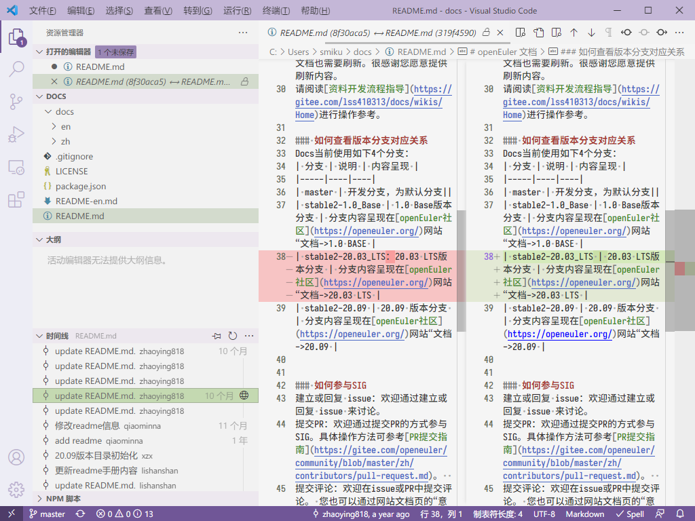

# openEuler开源社区全球化贡献指南


# 前言

我国开源领域一步一个脚印，从最初的蹒跚学步已经走入高速发展阶段。开源已成为技术应用和行业数字化发展的基石。开源大潮席卷全球，中国的开源社区正向世界走去。而要让中国开源真正走向世界，打破语言壁垒是第一要务，这就需要大量全球化语言贡献者助力。本文以贡献Gitee平台上的openEuler社区为例，旨在为开源社区的全球化贡献者提供详细的贡献指导，从基础介绍到网页操作到工具使用再到贡献流程，全方位推动translator到contributor的转变。


# 开源基础

## 初识开源社区
### 介绍

开源即开放源代码（Open Source Code），也称为源代码公开，指的是一种软件发布模式。开源社区又称开放源代码社区（Open Source Code Community or Open Source Community），一般由拥有共同兴趣爱好的人所组成，根据相应的开源软件许可证协议公布软件源代码的网络平台，同时也为网络成员提供一个自由学习交流的空间。从一定程度上讲，开源社区与开源产品的边界较为模糊，如Linux既指开源社区，由参与者共同管理，同时又指一套性能稳健的操作系统，其内核（Linux kernel）成为许多派生操作系统如Ubuntu的搭建基础。（百度百科）  
开源社区发展迅速，贡献者遍布全球且呈高速增长之势。据全球最大开源项目托管平台 GitHub 统计，2020年较上一年新增了1600万开发者用户，预计2025年开发者用户的数量将达到1亿。这其中，在 GitHub 的中国开发者数量及开源贡献度增长已成为全球最快。GitHub 预测到2030年中国开发者将成为全球最大的开源群体。（电子信息产业网） 

### 主流开源社区

| 名称 | 简述    | 网址 |
| :---------------- | :----------- | :-------------- |
| Linux内核社区           | 由全球不同地方的开发人员组成，它以代码、风格、开发流程的高质量标准著称。  | [https://www.kernel.org/](https://www.kernel.org/)    |
| Alpha             | Alpha处理器在Linux领域中很受欢迎，尤其用以处理高性能计算。  | [https://www.alpha.org/](https://www.alpha.org/)     |
| PowerPC            | 提供对使用PowerPC微处理器的Mac计算机的支持，同时也会支持一些IBM的系统。  | [https://www.powerprogress.org/en/](https://www.powerprogress.org/en/)     |
| Apache           | 以讨论Linux/Unix类操作系统技术、软件开发技术、数据库技术和网络应用技术等为主的开源技术社区网站。其宗旨是给所有爱好Linux/Unix技术、开源技术的朋友提供一个自由、开放、免费的交流空间。| [https://community.apache.org/](https://community.apache.org/)     |
| SourceForge          | SourceForge.net (SF.net)是开源软件的开发者进行开发管理的集中式场所，也是全球最大开源软件开发平台和仓库，由VA Software提供主机，并运行SourceForge软件。 | [https://sourceforge.net/](https://sourceforge.net/)      |
| Google Source          | 谷歌的android代码开源网站，包含了谷歌的各代nexus的源码，这些源码都是跟随android的版本演进。 | [https://android.googlesource.com](https://android.googlesource.com); [https://github.com/android/](https://github.com/android/)

### 开源社区的角色
>  

### 贡献开源的意义

**巩固现有技能**：无论是撰写代码、设计用户界面、图形设计、撰写文档、亦或是组织活动，假如你有实践的愿望，你总能在开源项目中找到自己的位置。   
**建立声誉（职业口碑）**：由于开源下所有工作都是公开的，开源项目会是一个很好展示你实力的地方。  
**遇见知己**：开源项目一般都会有一个和谐、热心的社区。很多人便是通过技术研讨会亦或是聊天室的深入探讨建立起深厚友谊。  
**学习领导和管理的艺术**：开源为实践领导力和管理技能提供了很好的机会，比如解决冲突、组织团队、工作的优先级排列。  
**寻找导师/帮助他人**：和他人在一个共享的项目下工作，这意味着需要向他人解释清楚自己是如何做的，同理，也需要向他人求助，询问别人是如何做的。相互学习和彼此教学对于每位参与者都能满载而归。  
**鼓励做出改变**：在开源的世界里，贡献者不一定非得是拥有大量经验的人。在开源的项目中，没有那么多的顾忌，你只需要做就可以了，哪怕只是纠正网站一个小小的拼写错误。开源让人们在很舒服的状态做事，而这才是这个世界应有的体验。(开源社)

### 开源软件许可证协议

开源许可协议（License）是指开源社区为了维护作者和贡献者的合法权利，保证软件不被一些商业机构或个人窃取，影响软件的发展而开发的协议。  
License的条款由权利、义务、限制三种组成：  
●	权利：你可以使用该软件做什么事情  
●	义务：你使用这个软件时必须履行什么样的义务  
●	限制：你不能够做什么事情  
开源许可证是一类组合。对于大部分开源许可证，权利（红框）均授予，著作权人几乎不承担任何义务（蓝框），只是被授权人承担的义务又较多不同（绿框）。  (License遵从性指导书)
>  

以下为openEuler G11N SIG的许可证实例：
>  

在国际化贡献中，多语言文件的license应与中文license保持一致。

## 初识openEuler

### 介绍

openEuler 是一个开源、免费的 Linux 发行版平台，通过开放的社区形式与全球的开发者共同构建一个开放、多元和架构包容的软件生态体系。同时，openEuler也是一个创新平台，鼓励任何人在该平台上提出新想法、开拓新思路、实践新方案。  
openEuler的愿景是：通过社区合作，打造创新平台，构建支持多处理器架构、统一和开放的操作系统openEuler，推动软硬件生态繁荣发展。

### openEuler组织架构

>  


### openEuler贡献流程

> 

（openEuler官网）


# Gitee基础

Gitee 是开源中国社区2013年推出的基于 Git 的代码托管服务，目前已经成为国内知名的代码托管平台，致力于为国内开发者提供优质稳定的托管服务。Gitee 除了提供最基础的Git代码托管之外，还提供代码在线查看、历史版本查看、Fork、Pull Request（PR）、打包下载任意版本、Issue、Wiki 、保护分支、代码质量检测、PaaS项目演示等方便管理、开发、协作、共享的功能。本章介绍Gitee贡献相关概念和操作。 （Gitee网站）

## Issue提交指南

### Issue简介

**名词解释**：Issue是指一项待完成的工作，这个工作可以是问题、事务、需求和建议等。每一个Issue都包含该工作的所有信息和历史，便于后来的人了解该项工作的所有方面和过程。  
**来源和作用**：Issue的概念起源于客服部门，用户打电话反馈问题，客服就创建一个工单（ticket），后继每一个处理步骤、每一次和用户的交流都要更新到工单内，记录全部的过程信息，这就是Issue的前身。随着后来的不断扩展，逐步演变成制定和实施软件开发计划的全功能项目管理工具。  
openEuler社区直接使用Gitee提供的Issue跟踪和管理系统。

### Issue基本功能

Gitee的每一个仓库内都有一个Issue面板。

> 

进入该面板，点击“+新建Issue”，就可以新建一个Issue，可以选择需求的类别。目前openEuler有任务、需求、缺陷、版本、翻译、CVE和安全问题等类别，每个类别对应一个提交模板，如下图所示。  

> 

### 需求类Issue提交和处理指导
不同类型的Issue都有各自完整的提交和处理流程，下面以需求类Issue为例。参考以下流程图。 
> 

**步骤 1**	新建需求类Issue（Issue状态：待办）
请进入需求对应的团队或项目的repository内，选择Issue面板，点击“新建Issue”。  
如果不确定该需求对应的团队或项目，请在community-issue中创建，会有社区的开发者帮助进行归属等信息的确认。  
在标题栏的单选下拉框将Issue类型设置成“需求”，系统会自动调出需求模板。  
在标题栏**简要描述需求的要点**。  
在详细说明框内说明需求的场景和价值。  
*请注意：清晰完整的描述有助于团队成员理解，并被更快的接受和排入开发计划。*  

**步骤 2**	团队成员审核Issue（Issue状态——通过：进行中；拒绝：已拒绝 ）  
**2.1** 审核后接纳
团队成员（maintainer或者committer）审核后认为可以接纳该需求，则由审核人补充接纳需求的相关信息，并包含：  
●	检查并设置该需求所属的项目。  
●	设置该需求建议合入的里程碑信息（规划版本信息）。  
●	设置该需求的优先级标签，请在标签栏选择“feature:High”、“feature:Medium”或者"feature:Low"。  
完成以上的信息以后，请将该Issue的“当前状态”调整成“进行中”（**进入步骤3**）。  
**2.2** 描述不清晰挂起  
团队成员审核后认为描述的信息不清晰，可以在该Issue的评论区留言或在邮件列表中讨论，让提交人继续补充相关信息。  
●	如果在一个月内提交人未及时补充相关信息，则系统会自动关闭该问题（**跳到步骤4**）。  
●	Issue提交人补充信息后，可以通过评论让团队成员审核（**跳到步骤2**）。  
**2.3** 审核后不接纳  
团队成员审核后，由于需求价值不高等原因认为暂不接纳，可以在评论区留言或在邮件列表中讨论说明原因。确认后将Issue的“当前状态”调整成“已拒绝”（**跳到步骤4**）。 

**步骤 3**	认领或分派Issue（Issue状态：开启）  
已经进入开发阶段的需求，可以主动认领，也可以由团队成员分配。可以在评论框内输入/assign来把Issue分配给自己，或分配给其他人。  

**步骤 4**	**关闭Issue**，关闭Issue有三种情况：  
需求完成后关闭，可以由认领人手工修改状态，也可以通过关联PR后，由PR审核通过后系统自动关闭。  
需求被拒接关闭，由审核人手工修改状态。  
需求超期后关闭，由系统自动根据需求停滞的时间进行超期关闭的操作。  
（openEuler Issue提交指南）


## PR提交指南

Pull Request（PR）是贡献者修改源代码后，请求目标仓库采纳该修改时提交的一种请求。

### PR提交前验证  

提交PR是对项目上的master主干的一次合入申请，为保证合入质量，这个动作是需要小心谨慎的。在提交PR之前，请先完成本地验证，以便在一定程度上保证在提交PR后的持续集成测试的通过。由于不同项目的本地验证方法不同，可以参考此章节内容以获取帮助。

### PR提交

**步骤 1**	提交PR请求。  
在Gitee上提交PR的具体操作，请参考下文Gitee工作流说明。为了更快得到响应，可以给PR添加标签，或提供更详细的信息，这里需要特别提示的是：  
●	**关联Issue**：如果提交的PR是针对某个Issue的，请在提交的描述框内添加“#”字符，此时机器人会自动关联出当前存在的Issue，你可以通过此种方式快速链接到关联的Issue。  
●	**标注优先级**：可以在创建PR的时候，选择PR的优先级。或者在评论区通过/priority high给PR添加高优先级标签。  
●	**标注是解决bug的合入**：可以在描述框通过输入/kind bug来标注该PR是合入解决问题的代码，以便于大家更快的回应你的PR请求。  
●	**标注所属SIG**：为了方便查找，也可以在描述框通过输入sig sig-name来标识该PR所属的SIG。  

**步骤 2**	分配评审人。    
提交PR以后，社区机器人会自动分配评审人，你也可以指定评审人。指定评审人有两种方式，可以在创建PR的时候，在右侧的下拉框中选择评审人。也可以在评论框中输入/assign @reviewer把该PR分配给对应的人。如果想把PR提交给项目的核心成员评审，以便于更快的获得批准，可以有两种方式获取到核心成员的信息：  
**方式一**：该Repository的owners文件（该文件通常在该repository的根目录下）中查看，此文件保存的是所有该Repository的评审人列表。  
**方式二**：可以到该项目所属的SIG的首页内查看README.md文件，此文件会列出该SIG的负责人，所有项目以及项目的负责人。

**步骤 3**	自动化测试。  
如果您提交成功以后，看到PR上有openeuler-cla/no的标签，说明您还未和社区签署贡献者协议，请您先按照社区机器人的提示，完成贡献者协议的签署。具体操作详见后文。  
提交成功以后，社区机器人会启动自动化测试，为了避免浪费评审人时间，通常只有自动化测试通过的PR，评审人才会参与评审。你可以在PR的下方看到自动化测试的结果。  
如果自动化测试失败，您可以通过“Build Details”查看失败的原因。  
>   

点击“Build Details”，可以看到具体的log信息。然后可以在里面搜索“Error”，快速的定位到错误的信息。  
修改后，你可以在评论框输入/retest命令，让社区机器人重新发起一次自动化测试。

**步骤 4**	PR审核。  
如果审核人通过你的PR，会在评论区添加/lgtm和/approve，以表示对本次PR提交的认同。  
审核人可以在评论区发表意见，也可以在审核文件的时候，在发现问题处添加审核意见。无论哪种方式，都会在评论区显示出来。区别是，后者的评论会显示出“代码评论”，你可以通过“详情”查看评论具体指向的出处。  
为了表示对评审人意见的尊重，如果对意见有异议，请回复该意见说明原因；如果接纳评审人意见，也请做出简单的回应，便于确认后继的提交是否已按照所有接纳意见完成修改。  
**请注意，在使用/approve前至少要有一个/lgtm。**  
 
### 未完成PR标记  
如果想在PR请求完成之前先征求大家的意见，有两种方法可以实现此目的：  
1.	可以在评论区添加hold或hold-cancel标签  
2.	可以在PR请求的标题中添加WIP或[WIP]前缀  

当存在这两个标签时，将不会考虑合并你的PR请求。  

（openEuler PR提交指南） 

## Gitee贡献工作流
> 

**步骤 1**	开展工作流前的准备。  
安装Git：请先确保你的电脑上已经安装了Git软件。Git具体用法详见2.4.1 Git。  
在开展Gitee的工作流之前，需要先在openEuler的代码托管平台的上找到感兴趣的Repository。如果还未找到对应的Repository，请参考此章节的内容。 

**步骤 2**	从云上fork代码分支。  
找到并打开对应的Repository的首页。  
点击右上角的 Fork 按钮，按照指引，建立一个属于个人的云上fork分支。  
>   
>  

**步骤 3**	把fork分支复制到本地。  
请按照以下的复制过程将Repository内的代码下载到你的在计算机上。    
1.	创建本地工作目录：  
需要创建本地工作目录，以便于本地代码的查找和管理。  
```mkdir /YOUR_PATH/src/gitee.com/${your_working_dir}```
2.	完成git上用户名和邮箱的全局配置（如果之前已经完成过此项配置，请忽略）。  
把git上的 user 设置成你gitee的个人名称：  
```git config --global user.name "your Gitee Name"```  
配置你的git邮箱：  
```git config --global user.mail "email@your_Gitee_email"``` 
3.	完成SSH公钥注册（如果没有完成此注册，每次都要重新输入账户和密码）。  
① 生成ssh公钥。  
```ssh-keygen -t rsa -C "email@your_Gitee_email"```  
```cat ~/.ssh/id_rsa.pub```  
② 登录你个人的远程仓库网站Gitee账户并添加你的ssh公钥。    
请在Gitee网页点击右上角的“个人头像”进入个人Gitee账户，并点击个人头像下的“个人设置”，进入个人设置页面。在“个人设置->安全设置”下，点击“SSH公钥”，在“添加公钥”内把cat命令获取到的ssh公钥添加进去。  
 ③在个人电脑上完成gitee在SSH上的登记。  
ssh -T git@gitee.com
>   

**步骤 4**	克隆远程仓库到本地。  
●	请注意openEuler有几个组织，请确认你所下载的远程仓库的组织名称  
●	可以在repository内复制远程仓库的拷贝地址，得到$remote_link：  
> 

●	在本地电脑执行拷贝命令：  
把远程 fork 仓库克隆到本地  
```git clone https://gitee.com/$user_name/$repository_name```  
设置本地工作目录的 upstream 源（被 fork 的上游仓库）  
```git remote add upstream https://gitee.com/openeuler/$repository_name```  
设置同步方式  
```git remote set-url --push upstream no_push```   

**步骤 5**	拉分支（可选）。  
```git fetch upstream```  
```git checkout master```  
```git rebase upstream/master```  
从这里拉分支:  
```git checkout -b work```  
然后在 work 分支上编辑和修改代码。  

**步骤 6**	保持你的分支与master同步。  
```While on your work branch```  
```git fetch upstream```  
```git rebase upstream/master```  
执行merge的时候，请不要使用 git pull 替代上面的 fetch/rebase。因为这种方式会使提交历史变得混乱，并使代码难以理解。  
**步骤 7**	在本地工作目录提交变更。  

提交你的变更  
```git add .```  
```git commit -m "提交原因"```  
**步骤 8**	在Gitee上创建一个 pull request。  

1.	访问你在 https://gitee.com/$user/openEuler的页面。  
2.	把你的分支选到提交使用的 work 分支上，点击+ Pull Request 。具体位置如下图所示：
3.	在创建新PR界面，确认源分支和目标分支，选择创建。  
> 

**步骤 9**	查看和回应代码审查意见。  
你提交PR申请后，PR被分配给一个或多个检视者。这些检视者将进行检视，以确保提交的正确性，不仅包括代码的正确，也包括注释和文档等。  
(Gitee工作流说明)

## Git与VS Code基础

### Git
Git是一个免费的、开源的分布式版本控制系统，可以有效、高速地处理项目版本管理。  
#### 基本概念  

**工作区**：就是你在电脑里能看到的目录。  
**暂存区**：英文叫 stage 或 index。一般存放在 .git 目录下的 index 文件（.git/index）中，所以我们把暂存区有时也叫作索引（index）。  
**版本库**：工作区有一个隐藏目录 .git，这个不算工作区，而是 Git 的版本库。  
> 

●	图中左侧为工作区，右侧为版本库。在版本库中标记为 "index" 的区域是暂存区（stage/index），标记为 "master" 的是 master 分支所代表的目录树。  
●	图中我们可以看出此时 "HEAD" 实际是指向 master 分支的一个"游标"。所以图示的命令中出现 HEAD 的地方可以用 master 来替换。  
●	当对工作区修改（或新增）的文件执行 git add 命令时，暂存区的目录树被更新，同时工作区修改（或新增）的文件内容被写入到对象库中的一个新的对象中，而该对象的ID被记录在暂存区的文件索引中。  
●	当执行提交操作（git commit）时，暂存区的目录树写到版本库（对象库）中，master 分支会做相应的更新。即 master 指向的目录树就是提交时暂存区的目录树。  
●	当执行 git reset HEAD 命令时，暂存区的目录树会被重写，被 master 分支指向的目录树所替换，但是工作区不受影响。  
●	当执行 git rm --cached <file> 命令时，会直接从暂存区删除文件，工作区则不做出改变。  

#### Git创建仓库
●	Git 使用 git init 命令来初始化一个 Git 仓库，Git 的很多命令都需要在 Git 的仓库中运行，所以 git init 是使用 Git 的第一个命令。在执行完成 git init 命令后，Git仓库会生成一个.git 目录，该目录包含了资源的所有元数据，其他的项目目录保持不变。  
如果当前目录下有几个文件想要纳入版本控制，需要先用 git add 命令告诉Git开始对这些文件进行跟踪，然后提交：  
```$ git add *.c```

```$ git add README```  

```$ git commit -m '初始化项目版本'```  

以上命令将目录下以 .c 结尾及README文件提交到仓库中。  
>注： 在Linux系统中，commit 信息使用单引号 '，在Windows系统，commit信息使用双引号 "。

所以在 git bash 中 git commit -m '提交说明' 这样是可以的，在Windows命令行中就要使用双引号 git commit -m "提交说明"。  
●	我们使用 git clone 从现有 Git 仓库中拷贝项目。  
克隆仓库的命令格式为：  
```git clone <repo名>```  
如果我们需要克隆到指定的目录，可以使用以下命令格式：  
```git clone <repo名> <directory目录>```  
参数说明：  
repo: Git 仓库。  
directory: 本地目录。  
比如，要克隆 Ruby 语言的 Git 代码仓库 Grit，可以用下面的命令：  
```$ git clone git://github.com/schacon/grit.git```  

执行该命令后，会在当前目录下创建一个名为grit的目录，其中包含一个 .git 的目录，用于保存下载下来的所有版本记录。  
如果要自己定义要新建的项目目录名称，可以在上面的命令末尾指定新的名字：  
```$ git clone git://github.com/schacon/grit.git mygrit```

●	我们使用如下命令设置提交代码时的用户信息。  
```$ git config --global user.name xxx``` 

```$ git config --global user.email xxx@xxx```

如果去掉 --global 参数只对当前仓库有效。  

#### Git基本操作 

Git常用的是以下6个命令：**git clone**、**git push**、**git add** 、**git commit**、**git checkout**、**git pull** 
> 

一个简单的操作步骤：  
```$ git init```  

```$ git add .```  

```$ git commit```  
●	git init - 初始化仓库。  
●	git add . - 添加文件到暂存区。  
●	git commit - 将暂存区内容添加到仓库中。 

(Git菜鸟教程)

#### Git常用命令

##### 创建仓库命令
| 命令 | 说明    | 
| :---------------- | :----------- | 
| git init           | 初始化仓库  | 
| git clone           | 拷贝一份远程仓库，也就是下载一个项目。|

##### 提交与修改命令

| 命令 | 说明    | 
| :---------------- | :----------- | 
| git add           | 添加文件到暂存区。  | 
| git status          | 查看仓库当前的状态，显示有变更的文件。|
| git diff           | 比较文件的不同，即暂存区和工作区的差异。 | 
| git commit          | 提交暂存区到本地仓库。| 
| git reset          | 回退版本。 |
| git rm         | 将文件从暂存区和工作区中删除。 | 
| git mv        | 移动或重命名工作区文件。 | 

##### 提交日志
| 命令 | 说明    | 
| :---------------- | :----------- | 
| git log           | 查看历史提交记录。  | 
| git blame <file>          | 以列表形式查看指定文件的历史修改记录。|

##### 远程操作
| 命令 | 说明    | 
| :---------------- | :----------- | 
| git remote          | 远程仓库操作。  | 
| git fetch          | 从远程获取代码库。|
| git pull           | 下载远程代码并合并。 | 
| git push         | 上传远程代码并合并。| 

#### Git特殊操作

##### 处理冲突提交
如果发现提交的PR带有以下的标记，说明你提交的PR和本地存在冲突，需要处理冲突。  
>  

**步骤 1**	先将分支切换到master上，并完成master的rebase。  
```git checkout master```  
```git fetch upstream```  
```git rebase upstream/master```  

**步骤 2**	再将分支切换到您使用的分支上，并开始rebase。  
```git checkout yourbranch```  
```git rebase master```  

**步骤 3**	此时你可以在git上看到冲突的提示，你可以通过vi等工具查看冲突。

**步骤 4**	解决冲突以后，再把修改提交上去。  
```git add .```  
```git rebase --continue```  
```git push -f origin yourbranch```  

##### 合并提交

如果你提交了一个PR以后，根据检视意见完成修改并再次提交了PR，不想让审阅者看到多次提交的PR，因为这不便于继续在检视中修改，那么可以合并提交的PR。合并提交的PR是通过压缩Commit来实现的。   
**步骤 1**	现在本地分支上查看日志。  
```git log```  

**步骤 2**	然后把顶部的n个提交记录聚合到一起进入，注意n是一个数字。  
```git rebase -i HEAD~n```  
把需求压缩的日志前面的pick都改成s，s是squash的缩写。注意必须保留一个pick，如果将所有的pick都改成了s就没有合并的目标了，会发生错误。 

**步骤 3**	修改完成以后，按ESC键，再输入:wq，会跳出一个界面，问你是否进入编辑提交备注的页面，输入e以后，进入合并提交备注的页面。请把需要合并的备注都删掉，只保留合并目标的备注，再按ESC键，输入:wq保存退出即可。

**步骤 4**	最后完成提交。  
```git push -f origin yourbranch```  

**步骤 5**	回到gitee上的PR提交页面查看，您就可以看到之前的提交已经合并了。  
详细请见：https://www.runoob.com/git/git-gitee.html。  
（Gitee工作流说明）

### VS Code  
Visual Studio Code（简称 VS Code）是由微软开发的轻量级代码编辑器，支持包括 Markdown 在内的多种语言和格式，内置了命令行工具和 Git 版本控制系统。VSCode 中很多操作可以通过软件内命令行来使用，呼出软件内命令行的默认快捷键是 F1 或 Ctrl+Shift+P，请牢记。本文内有>前缀的命令是 VS Code 命令行的命令，否则是 Git Bash 命令。  
>  

#### 软件与扩展安装

1.	安装并配置好 Git。  
2.	下载安装 VS Code。  
3.	可安装中文语言包，语言包在扩展商店中以扩展的形式提供。要打开扩展商店：点击左侧边栏的扩展图标，或快捷键 Ctrl+Shift+X，或呼出命令行，输入>extensions: install extensions 以命令打开。  
注：VSCode 软件内命令行一般不需要输入完整命令，可输入>extensions 或 >install extensions 之后用键盘上下键选择命令补全。可以输入中文命令描述。   
点击[安装]按钮即可安装，点击项目可进入商店页面查看详情。  
4.	安装 GitLens 扩展，用于 Git 相关操作。   
>  


#### VSCode界面和Git
为方便解说UI内容，先将Gitee仓库用VS Code打开，这里假定你已经把 openEuler/docs仓fork到了自己的远程仓，并且 >git: clone 或用 git bash clone 到了本地计算机上：  
打开本地仓：在 VS Code 中用 >git: clone 克隆完成后会提示是否打开。如果是用 Git Bash 克隆的本地仓：在Windows资源管理器中打开本地仓所在文件夹，右键菜单通过Code打开，或在VSCode中点击文件>打开文件夹，或 >File: Open Folder。打开界面如下图。  
> 

图中已经点击预览 README.md。单击是预览文件，文件名在打开的编辑器中显示为斜体；双击是打开文件，文件名不显示斜体。预览时做任何改动也会打开文件。    
右下角显示 Markdown 处可以点击更改语言模式，如果编辑器没有自动检测到Markdown语法可以手动选择。    
查看（预览或打开）文件时，时间线会显示当前文件的提交历史，底栏会显示光标当前所在行的作者和提交时间。点击时间线中任意提交历史可以比较查看当前文件在本次提交中的改动。   
>  

上图在 README.md 中做了改动但没有保存，文件名前会加上圆点图标，并且有文字提示 1 个未保存。  
如要对比本地的两个文件，在文件树（即图中 DOCS）或打开的编辑器中右键点击一个文件选择以进行比较，再右键另一个文件与已选项目进行比较，或者按住 Ctrl 选择两个文件将已选项进行比较。改动后未保存的文件也可以与已保存的版本比较。  
文件树中可以进行新建文件/文件夹、复制粘贴、重命名等常规操作。在资源管理器页，按 Ctrl+E 可以在文件树中以文件名或路径进行搜索。  
在编辑器中更改并保存文件后，有改动的文件会出现在更改中。点击这里的文件可以显示对比，即本地最新的文件与最后一次拉取的文件对比。  
在更改文件树中的文件名右侧点击 + 号将文件放入暂存区。等效于对当前文件使用 >git: stage changes 命令。  
也可以 Ctrl+左键多选文件后点击 + 批量放入暂存区。命令 >git:stage all changes 可以把所有更改的文件放入暂存区。  
点击暂存区中文件名右侧的 - 可以移出暂存区。  
要提交暂存区中的文件，按源代码管理项下输入框中的提示，输入提交信息按 Ctrl+Enter 提交。等效于 >git: commit staged。  
未暂存的文件可以使用 >git: commit 或 >git: commit all 提交，确认后文件可跳过暂存直接提交。  
提交的文件存放于本地库中，还未发布到远端库。可以使用 >git: undo last commit 撤消最后一次提交。  
提交后，窗口左下角会显示提交的数量，可以点击此处发布到远端库（同时会拉取远端库的新提交）。如果要只发布而不拉取，可以使用 >git: push。如果显示远端库有新提交，先拉取至本地，以免提交后产生冲突。  
>  

**COMMITS** 项显示当前分支中的所有提交历史。点击提交项可以展开显示更改的文件，点击文件可以显示与上个版本比较的改动。    
>  

FILE HISTORY 即编辑器中当前打开文件的提交历史，类似于资源管理器页中的时间线。    
BRANCHES 显示本地分支中的提交。参见下文 REMOTES。    
REMOTES 显示远端库中所有分支的提交。右键选择 Switch to Branch... 切换到另一分支，并将这个分支保存到本地，显示在 BRANCHES 中。点击左下此处也可以切换分支。    
>   
STASHES 储藏区。修改后的文件如果不满意，不想放在本次提交里，或者有未提交的更改但想要切换到其他分支进行操作，可以 >git: stash 先放入储藏区。  
TAGS 列出每个标签对应的提交。  
SEARCH & COMPARE 提供搜索提交和比较分支的功能。Search Commits... 可以选择按消息内容、作者、文件等搜索。Compare References... 可以选中两个分支进行比较，提交比较和文件树比较。文件树比较会显示文件路径变化，以及内容有差异的同名文件。  
>  

创建图中的比较时，先选择了 master 分支（显示在右侧），后选择了 stable2-21.09 分支（显示在左侧）。    
文件树中 - 号表示在右侧分支中缺少的文件，+ 号表示右侧分支中多出的文件，± 表示同名文件内容有差异，点击打开对比视图。    

#### 保持本地提交记录和远端上游仓同步  

为防止创建的Pull Request与上游仓内容冲突，强烈建议每次提交前将上游仓的 commit 拉取到当前分支。  

**步骤 1**	在VS Code中添加上游仓。以主仓openEuler/docs为例，在网页端克隆/下载按钮复制SSH地址 git@gitee.com:xxxx.git。运行以下命令添加主仓，显示在源代码管理页的REMOTE下:    
```git remote add upstream git@gitee.com:xxxx.git```  
upstream 为自定义名称  

**步骤 2**	抓取主仓的commits。  
```git fetch upstream```  
```git fetch upstream```  

**步骤 3**	将主仓的commits合并到本地的分支。以 master 分支为例：  
```git checkout master```   
↑切换到 master 分支，如已在 VS Code 中切换则省略  
```git merge upstream/master``` 

**步骤 4**	解决源代码管理中提示的冲突（如有），然后提交自己的改动。  


#### 合并commits  

为保持提交记录简洁（以及满足部分仓库的要求），一个 PR 应当只包含一个 commit。如果多个 commits已经提交到远端库，靠回退版本 (git reset)来合并 commits。  
假设**源代码管理 > COMMITS** 当前的 commit 记录如下：  
```YOUR_COMMIT_3 ```   
```YOUR_COMMIT_2 ```   
```YOUR_COMMIT_1```  
```OTHERS_COMMIT_2```  
```OTHERS_COMMIT_1```  

要合并 YOUR_COMMIT_*，（记录下 commit message）右键点击 OTHERS_COMMIT_2 选择 Reset Current Branch to Commit...，然后选择 Soft Reset，即可回退到 OTHERS_COMMIT_2 的版本，三个 YOUR_COMMIT_* 的改动会回到上方更改区域，重新填写commit message 强制提交即可。  
版本回退后，因为本地的版本早于远端库的版本，必须**使用 force push 覆盖远端库**：打开 VS Code 选项，搜索 Allow Force Push 项并勾选，然后按 F1 呼出命令行，输入 push force 等类似关键字，选择相关选项。 

#### 推荐扩展

●	Markdown Editor (zaaack.markdown-editor)，支持所见即所得模式和分屏预览模式的 Markdown 编辑器。  
●	Markdown Preview Enhanced (shd101wyy.markdown-preview-enhanced)，增强 Markdown 预览功能，包含 TOC 自动生成功能。快捷方式同样为 Ctrl+Shift+V，覆盖 VSCode 自带的预览查看器。安装后如果需要使用自带的预览查看器，在编辑器窗口顶端的文件标签上右键 -> 打开预览。自带的查看器中，双击句段可以跳转到原文相应句子。  
自动生成 TOC：>markdown preview enhanced: create toc （需要保持预览窗口打开）。保存时自动更新 TOC。
●	GitHub Markdown Preview (bierner.github-markdown-preview)，或仅安装其中的核心扩展 Markdown Preview Github Styling (bierner.markdown-preview-github-styles)，以 GitHub 格式显示 Markdown 预览，效果接近Gitee网页。  
●	Code Spell Checker (streetsidesoftware.code-spell-checker)，自然语言拼写检查扩展，除英语外还有多种语言可选。  
●	CJK Word Handler (sharzyl.cjk-word-handler)。VSCode 默认以空格、","、"." 等英文符号作为分隔符，导致整句中文被识别为一个整词，使用 Ctrl+←/→ 相关操作时非常不便。这个扩展可以让 VSCode 支持中文分词逻辑。
●	Bookmarks (alefragnani.bookmarks)，以行为坐标添加书签。  
（VSCode for openEuler Docs Globalization）。  

## Markdown语法基础

Markdown是一种轻量级标记语言，创始人为约翰·格鲁伯。它允许人们使用易读易写的纯文本格式编写文档，然后转换成有效的XHTML（或者HTML）文档。  
Markdown编辑器有VS Code，Typora，和Markdown Online。Markdown编写的文档后缀为.md。    
1.	Markdown优势：  
−	排版方便，结构逻辑清晰  
−	纯文本编辑，轻量级  
−	兼容性和可移植性好  
−	纯键盘操作，写作效率高  
2.	Markdown标题：  
−	使用“=”和“-”标记一级和二级标题。  

    一级标题  
    =================
    二级标题
    -----------------

−	使用“#”号标记  
使用“#”号可表示 1-6 级标题，一级标题对应一个“#”号，二级标题对应两个“#”号，以此类推。  
    # 一级标题  
    ## 二级标题  
    ### 三级标题  
    #### 四级标题  
    ##### 五级标题  
    ###### 六级标题  
3.	Markdown字体：  

    *斜体文本*
    _斜体文本_
    **粗体文本**
    __粗体文本__
    ***粗斜体文本***
    ___粗斜体文本___

4.	Markdown区块：  
 区块引用是在段落开头使用 **>** 符号 ，然后后面紧跟一个空格符号。  
> 此部分展示区块引用内容。  

另外区块是可以嵌套的，一个 **>** 符号是最外层，两个 **>** 符号是第一层嵌套，以此类推。  
> 最外层引用内容
> > 第一层嵌套引用内容
> >
> > > 第二层嵌套引用内容  
5.	Markdown代码：  
如果是段落上的一个函数或片段的代码可以用反引号**`**把它包起来。 
也可以用 **```** 包裹一段代码，并指定一种语言（也可以不指定）。
```SQL
CREATE CUBE nation_cube 
ON nation 
WITH (AGGREGATIONS=(count(*), count(distinct regionkey), avg(nationkey), max(regionkey)),
GROUP=(nationkey),
format='orc', partitioned_by=ARRAY['nationkey']);
```
6.	Markdown链接：


链接的格式为[]括起的链接名称加()括起的链接地址，或者直接用<>括起的链接地址。  
[鲲鹏计算平台](https://e.huawei.com/cn/products/servers/computing-kunpeng)  
<https://e.huawei.com/cn/products/servers/computing-kunpeng>

7.	Markdown页内跳转：  
(1)	创建锚点。  

锚点：是在文章中的某个位置做标记。如果将一篇文章比作一条有多户人家的巷子，创建锚点就好比是给其中一户人家安装门牌号。在Markdown中，可以用id来定义位置，所以创建锚点就是创建一个id，语法如下(创建一个id为article_111标签)：  
>  

(2)	引用锚点。    
创建完锚点后，就相当于在文章的某个位置做了个标记，有了这个标记就可以使用 markdown 的语法(创建链接)引用这个位置，从而实现页内跳转。引用锚点本质上就是创建一个指向锚点的链接。语法如下：  
>  

链接名称：是自己想定义的任何名称或描述，一般根据文章上下文确定。  
锚点id：就是已经定义的锚点id。  

8.	Markdown图片：

图片的格式为!加[]括起的图片名称加()括起的图片地址(可转换为原始格式查看）。  
  
若是本地图片，在文件同一层级目录创建文件夹，文件夹名自定义，将图片放入其中。比如文件夹命名为images，文件命名为image 1，然后文件里图片的链接可为：  
  

>  

# openEuler社区全球化贡献
## 贡献范围
openEuler的全球化贡献可依托openEuler G11N 特别兴趣小组。该小组旨在向全球不同语言背景的openEuler开发者提供专业语言服务平台，向国内开发者普及全球化能力，跨越语言和文化障碍，壮大openEuler社区，使openEuler惠及更多开发者。G11N SIG贡献详细请见[openEuler G11N贡献指南](https://gitee.com/openeuler/globalization/blob/master/openeuler-g11n-contribution-guide.md)。  
openEuler社区的全球化贡献包括但不限于：  
1.	翻译openEuler社区材料：openEuler需要翻译的材料包括官网内容以及开源社区160+仓库的README，about，releases，博客、新闻、技术文档等。   
2.	推荐/翻译/撰写热点技术文档或博客：整合业界资讯和openEuler最新动态，选取合适内容进行国际化处理（多语转换、排版润色）后进行分享。撰写国际化和OS等主题博客，分享行业洞察和学习收获。推荐或翻译热点技术文档，为社区提供全球领域的技术新知识。  
3.	修改文档错误：发现各个仓库的多语言文件的错误并提交PR进行修改。  

## 贡献操作案例

本章以贡献openEuler博客翻译为例详细描述openEuler全球化贡献的基本流程。

### 使用工具提交PR
  
**步骤 1**	进[Gitee](https://gitee.com/)主页注册你的专属账号。

**步骤 2**	注册成功后登录，点击页面左上角的个人主页进入你的个人页面，点击头像下的“个人设置”，再在左边导航栏选择“邮箱管理”，设置一个你的常用邮箱作为主邮箱。   
>

**步骤 3**	签署openEuler社区[贡献者许可协议 (CLA)](https://clasign.osinfra.cn/sign/Z2l0ZWUlMkZvcGVuZXVsZXI=) 。请选择个人CLA。签署邮箱请填写你设置的主邮箱。

**步骤 4**	选择待翻译博客。访问openEuler主页，点击互动 > 博客（或直接点击[https://www.openeuler.org/zh/interaction/blog-list/](https://www.openeuler.org/zh/interaction/blog-list/)）进入博客页面。选择一篇博客进入博客详情页面。

**步骤 5**	查看博客网址并记录。  
>注：由于openEuler主页的博客源路径都在openEuler开源仓库，我们需要去到开源仓库获取源文档。

>  

**步骤 6**	打开[https://gitee.com/openeuler/openEuler-portal](https://gitee.com/openeuler/openEuler-portal)仓库，点击Fork将此仓库fork到个人仓。  

>  

**步骤 7**	在本地安装Git和VS Code工具。  
>注：可以只使用Git进行后面的操作，但是VS Code是GUI界面，对非代码贡献者比较友好，所以也推荐使用VS Code.

**步骤 8**	本地新建一个文件夹，命名为openEuler blogs或自定义。打开文件夹，右键单击从下拉列表里选择Git Bash Here.  
>  

**步骤 9**	在弹出的命令行窗口中执行以下命令来初始化本地库、配置个人远程库姓名与邮件信息、拉取远程库到本地。  
```git init    初始化本地库```  
```git config --global user.name 用户名   设置用户签名```  
```git config --global user.email 邮箱     设置用户签名```  
```git pull 个人仓SSH网址（如git@gitee.com:用户名/openEuler-portal.git）拉取个人仓库内容到本地```  
>注：
用户名为"Gitee ID "，即Gitee个人主页头像下方@的ID。  
Gitee可以根据git username和邮箱关联到Gitee账号。  

> 

**步骤 10**	打开本地库文件夹，进入路径**openEuler-portal/app/zh/blog**。此路径包含以作者命名的文件夹，译员可在对应文件夹中找到待翻译的源博客文件。  

>  

**步骤 11**	以Step 4中记录的博客网址为例（[https://www.openeuler.org/zh/blog/gaohuatao/2021-04-09-isulad-shimv1-shimv2-diff.html](https://www.openeuler.org/zh/blog/gaohuatao/2021-04-09-isulad-shimv1-shimv2-diff.html)）。 网址中blog/后面接的就是作者名（文件夹名）与文档名。在**openEuler-portal/app/zh/blog**路径中找到名为**gaohuatao**的文件夹，打开便可以获取博客源文档。

>  

注：格式不复杂的小文档也可以直接在线上仓库进行拷贝，但是openEuler博客内容普遍比较多，结构复杂，涉及很多代码块和表格，直接拷贝容易破坏格式，所以建议直接获取源文档。  

>  

**步骤 12**	翻译博客内容（包括图片）。贡献者根据计划进行翻译，翻译并自检完成后，发同行评审和外籍审校（如有机会，可发技术评审）。注意交付终稿前需再进行1-2轮工具检查。  
**步骤 13**	翻译完成后，进入拉去的本地库下**openEuler-portal/app/zh/blog**路径，创建以作者命名的文件夹，如**gaohuatao**，然后将翻译完成的文档和图片放入文件夹内。若已有该文件夹，直接放入文件即可。  
●	Git: 在Git CLI输入如下代码。  
```git add <file-path>  暂存更改```  
```git commit -m "<message>"  输入更改信息，比如Added an English blog.```  
```git push origin <branch-name>:<branch-name>  push更改内容到远程仓库```  
●	VS Code: 我们也可以直接在VS Code里对文档进行编辑并预览发布效果。  

>  

编辑完成后保存，文档进入暂存区。再点击暂存更改，编写此次commit的信息，再点确认（√）并同步更改到远端。  

>  

若同步更改后你的Gitee主页出现以下提示信息，push操作成功，如：  

>  

**步骤 15**	在个人仓库提交PR到主仓。首先进入个人仓，如https://gitee.com/用户名/openEuler-portal，选择**Pull Request**页签，点击**New Pull Request**，填写信息并提交。  
>  

提交成功后，主仓PR列表会显示你提交的PR。仓库maintainers会进行审核并合入。  


### 提交轻量级PR

零星变更可以在代码仓（主仓非个人仓）直接修改文档，创建轻量级PR。 这个适用于内容的少量更新优化，比如修改多语言材料的问题。  

**步骤 1**	根据提供的链接进入对应仓库，找到对应英文文档，单击进入，如图所示。
>   

**步骤 2**	点击右上角的编辑按钮进入在线编辑模式（Markdown格式）。  
>  

**步骤 3**	修改内容并检查完成后预览一下效果，确认无误后在扩展信息内简述变更原因，点击提交审核创建一个轻量级PR。若页面跳转到PR详情页面，则轻量级PR创建成功。 审核通过后你的内容就可以合入仓库。  
> 


# 参考链接

[https://kaiyuanshe.cn/article/github/how-to-participate-in-open-source/](https://kaiyuanshe.cn/article/github/how-to-participate-in-open-source/)  
[https://docs.qq.com/doc/DSnJVSmhDcHhrV25L](https://docs.qq.com/doc/DSnJVSmhDcHhrV25L)  
[https://www.openeuler.org/zh/](https://www.openeuler.org/zh/)  
[https://gitee.com/openeuler/community/blob/master/zh/contributors/issue-submit.md](https://gitee.com/openeuler/community/blob/master/zh/contributors/issue-submit.md)  
[https://gitee.com/openeuler/community/blob/master/zh/contributors/pull-request.md](https://gitee.com/openeuler/community/blob/master/zh/contributors/pull-request.md)  
[https://gitee.com/openeuler/community/blob/master/zh/contributors/Gitee-workflow.md](https://gitee.com/openeuler/community/blob/master/zh/contributors/Gitee-workflow.md)  
[https://www.runoob.com/git/git-tutorial.html](https://www.runoob.com/git/git-tutorial.html)  
[https://gitee.com/openeuler/G11N/blob/master/learning-materials/open-source-basics/vscode-for-g11n.md](https://gitee.com/openeuler/G11N/blob/master/learning-materials/open-source-basics/vscode-for-g11n.md)  
[https://gitee.com/openeuler/globalization/blob/master/openeuler-g11n-contribution-guide.md](https://gitee.com/openeuler/globalization/blob/master/openeuler-g11n-contribution-guide.md)  
[https://gitee.com/openeuler/G11N/blob/master/learning-materials/open-source-basics/markdown-basics.md](https://gitee.com/openeuler/G11N/blob/master/learning-materials/open-source-basics/markdown-basics.md)  


本文档遵循Creative Commons Attribution Share Alike 4.0 license.
